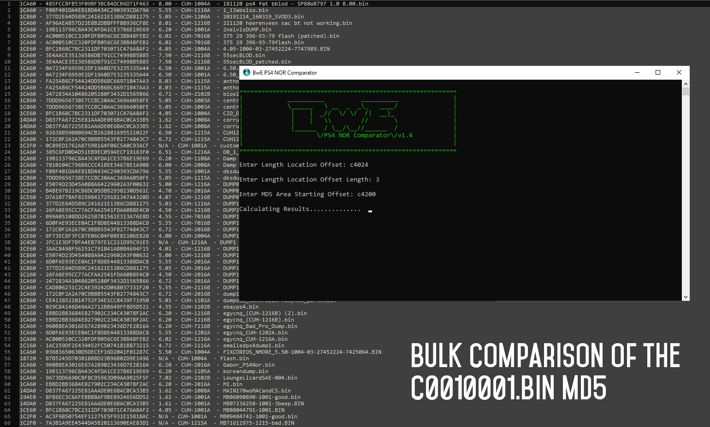

## BwE PS4 NOR Comparator ##

Hello!

Don't trust my PS4 NOR Validator? Have a whole bunch of dumps from the various consoles you have been repairing/collecting? Well now is your chance to shine!
I present to you the BwE PS4 NOR Comparator! Now you can gather vital information from all of your dumps at once and compare them all by yourself!

Be sure to use Notepad++ as the outputs can be large enough to crash your normal text editor. Oh and a multi-cored PC would help especially for statistics.

Note, you do not have to put '0x' in front of offsets, you can if you want but lower case inputs like `1cd601` is fine.

### Menu Options: ###

#### Filter Menu: ####

1. Compare Specific Version Only
2. Compare Specific SKU Only
3. Compare Specific Version & SKU Only
4. Compare All Dumps

#### Main Menu: ####

1. Compare Offsets (Hex)

	You will be asked for an offset and then the length. An example of this would be '1CD601' and then the length '8'.
	This will produce the ouput for 'UNK Unknown Flag 6' of a PS4 dump.
	
2. Compare Offsets (ASCII)

	You will be asked for an offset and then the length. An example of this would be '1CD601' and then the length '8'.
	This will produce the ouput for 'UNK Unknown Flag 6' of a PS4 dump.

3. Compare Offsets MD5

	As above, this will allow for you to seek an offset and length and gather the MD5 of the area.

4. Compare Offsets Entropy

	As above, but this will gather the entropy of the area you have chosen.

5. Double Offset Comparison

	Here you can compare two different areas against each other, it will ask you for the offset and length for both.
	
6. Dynamic MD5 Calculation

	This is the dynamic calculation, here you have to input the location of the offset (and length) that contains the file size, then you must input the starting offset of the file.
	An example of this is to get the MD5 of C0010001.BIN, you would input 'C4024' which is the location of the size and then size length '3'. This is required because the file size is
	different in each dump and the only way to determine the size is to read it at that offset. You then you input the start of the C0010001.BIN which is at a static location of 'C4200'.
	The output will then be the MD5 of each of the files in each of the dumps.

7. Compare File Entropy & Byte Count

	This will create a statistical output of the entropy and byte count for each dump, depending on how many you have in your folder this will take the longest time to complete.

8. Compare File MD5

	This will create a basic list of the MD5 of every dump.

### Version History: ###
- 1.10 (5/1/23) - Fixed Firmware Detection (v10+)
- 1.09 (13/11/22) - Added Filter (Version & SKU), Added Colourization To Found Dumps
- 1.08 (07/11/22) - Added Filter (By SKU, By Version, All Dumps), Mild Fix To Menu
- 1.07 (05/06/22) - Improved File Handling, Fixed MD5 Calculation Mistake (Option 3)
- 1.06 (23/06/21) - Added ASCII Output, Fixed $file Outputs On Screen.
- 1.05 (13/01/21) - Added Output Options, Added Statistics, Minor Code Change
- 1.04 (21/03/20) - Added Dynamic MD5 Comparison & Fine Tuning!
- 1.02 (02/03/19) - Added FW/BIOS Versioning & Made Outputs (Slightly) Prettier.
- 1.01 (20/01/19) - Whoops! Fixed Bug. Added Additional Comparison.
- 1.00 (19/01/19) - First Release!

### More Information: ###
- Compiled Version: https://betterwayelectronics.com.au/downloads/BwE_PS4_NOR_Comparator.rar
- Archive Password: BwE
- Program MD5: 2AF1A636E64E2C4E92DDA85A869EDA8C
